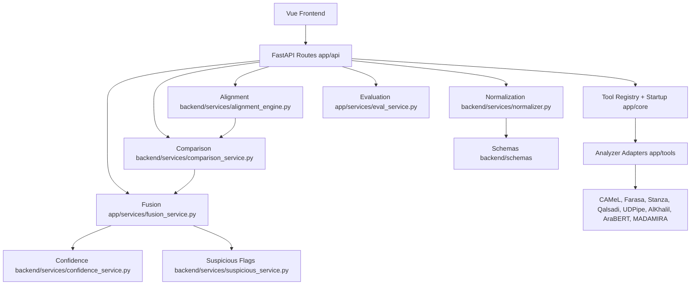

# Arabic NLP Platform Architecture Audit

## Scope

This cleanup pass reorganizes project structure, removes generated/scaffold artifacts, standardizes API response formatting, and documents the current architecture. It does not add analyzers, change analyzer algorithms, change fusion rules, or implement supervisor feedback.

## Architecture Diagram



## Project Architecture Tree

```text
arabic-nlp-platform/
  main.py
  app/
    api/                FastAPI route modules
    core/               startup, registry, cache orchestration
    models/             API response helpers and response models
    services/           active application services
    tools/              analyzer adapters used by the app runtime
    utils/              shared app constants, logging, helper functions
  backend/
    analyzers/          newer analyzer contracts and wrappers
    config/             settings and external tool path metadata
    schemas/            pydantic and typed response schemas
    services/           domain services for alignment, normalization, comparison, confidence
    utils/              backend text and compatibility utilities
  frontend/
    src/
      api/              API client setup
      assets/           global CSS only
      components/
        badges/         reusable status/source badges
        charts/         reusable charts and matrices
        tables/         reusable table cells
      composables/      Vue composables
      config/           frontend tool config
      constants/        design and tool constants
      router/           page routing
      utils/            frontend data utilities
      views/            dashboard, analysis, comparison, fusion, evaluation, reports
  docs/
    architecture_audit.md
```

## Folder Tree After Cleanup

```text
frontend/src/components/
  badges/
    ConfidenceBadge.vue
    ToolBadge.vue
  charts/
    HeatmapMatrix.vue
    ScientificChart.vue
  tables/
    EmptyCell.vue
```

```text
app/api/
  analyze.py
  compare.py
  evaluate.py
  fusion.py
  ui.py

app/models/
  api_response.py
  response_models.py
```

## Dependency Graph

```text
main.py
  -> app.api.*
  -> app.core.tool_registry
  -> app.tools.* loaders

app.api.analyze
  -> app.core.startup
  -> app.core.tool_registry
  -> app.models.api_response
  -> backend.schemas.unified_schema

app.api.compare
  -> app.core.startup
  -> backend.services.normalizer
  -> backend.services.alignment_engine
  -> backend.services.comparison_service
  -> app.models.api_response

app.api.fusion
  -> app.core.startup
  -> app.services.fusion_service
  -> app.models.api_response

app.api.evaluate
  -> app.core.startup
  -> app.services.eval_service
  -> app.services.fusion_service
  -> app.models.api_response

frontend views
  -> frontend/src/components/badges
  -> frontend/src/components/charts
  -> frontend/src/components/tables
  -> backend API endpoints
```

## Analyzer Isolation Contract

Each analyzer remains isolated behind its adapter module. The required analyzer boundary is:

- Input: plain Arabic text string from route/service layer.
- Output: tool response with `tool`, `status`, `input`, `word_count`, and `tokens`.
- Configuration: environment/tool paths under `backend/config` or adapter-local lazy loaders.
- Error handling: adapter returns unavailable/error payloads instead of crashing route handlers.
- Documentation: analyzer-specific notes belong near adapter modules or `backend/analyzers/README_unified_tools.md`.

## Fusion Layer Structure

Current responsibilities are separated as:

- Alignment: `backend/services/alignment_engine.py`
- Normalization: `backend/services/normalizer.py`
- Confidence: `backend/services/confidence_service.py`
- Conflict resolution/comparison: `backend/services/comparison_service.py`
- Final output: `app/services/fusion_service.py` and route envelopes in `app/api/fusion.py`

## API Response Standard

All non-streaming JSON route responses now use:

```json
{
  "status": "success",
  "message": "Human readable result",
  "data": {},
  "metadata": {},
  "errors": []
}
```

Legacy top-level fields such as `tools`, `fusion`, `comparison`, and `evaluation` are preserved for the existing frontend.

## Files Removed

- Python bytecode/cache artifacts: tracked `*.pyc` files and `__pycache__/` folders under project source.
- Vue scaffold files:
  - `frontend/src/components/HelloWorld.vue`
  - `frontend/src/components/TheWelcome.vue`
  - `frontend/src/components/WelcomeItem.vue`
  - `frontend/src/components/icons/*`
- Unused frontend assets:
  - `frontend/src/assets/base.css`
  - `frontend/src/assets/logo.svg`

Pre-existing deletion preserved:

- `app/services/_repair3_camel_root_patch_notes.txt`

## Files Renamed Or Moved

- `frontend/src/components/ConfidenceBadge.vue` -> `frontend/src/components/badges/ConfidenceBadge.vue`
- `frontend/src/components/ToolBadge.vue` -> `frontend/src/components/badges/ToolBadge.vue`
- `frontend/src/components/ScientificChart.vue` -> `frontend/src/components/charts/ScientificChart.vue`
- `frontend/src/components/HeatmapMatrix.vue` -> `frontend/src/components/charts/HeatmapMatrix.vue`
- `frontend/src/components/EmptyCell.vue` -> `frontend/src/components/tables/EmptyCell.vue`

## Files Added

- `app/models/api_response.py`
- `docs/architecture_audit.md`

## Files Merged

- Repeated route-level envelope dumping was merged into `app/models/api_response.py`.

## Refactoring Summary

- Standardized JSON API responses across active route modules.
- Removed generated bytecode from source control.
- Removed unused Vue starter components and unused starter assets.
- Grouped frontend reusable components by responsibility.
- Preserved active UI screens and all existing analyzer/fusion algorithms.
- Documented current backend/frontend module boundaries and dependency flow.

## Database Normalization

No application database schema was found in the audited source tree. Current persisted data appears to be file-based fixtures/exports and external analyzer resources. Database normalization is therefore not applicable in this cleanup pass.

## Follow-up Cleanup Candidates

- Consolidate the dual backend namespaces (`app` and `backend`) in a future migration after tests are added.
- Decide whether legacy/simple analyzer wrappers under `backend/analyzers` are still needed by future supervisor feedback.
- Add route-level tests for the standardized response shape before removing legacy top-level fields.
