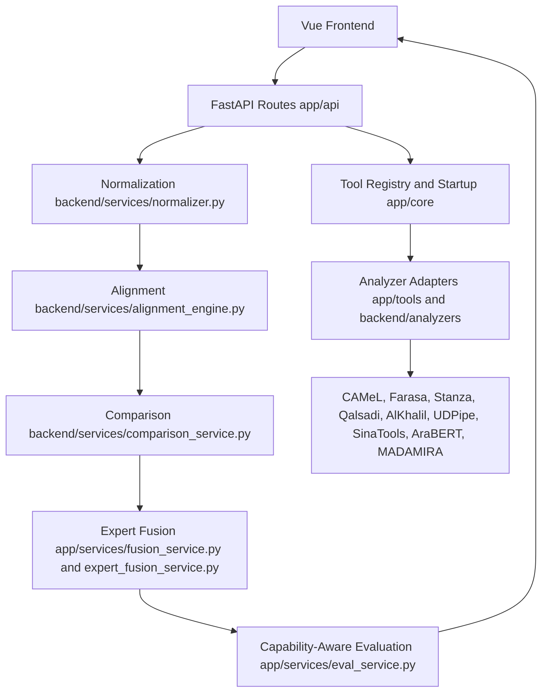

# Arabic NLP Platform Architecture Audit

## Final Audit Scope

This final pre-defense audit inspected the backend analyzer architecture, expert fusion, capability-aware evaluation, and Vue frontend research flow. It updates documentation only. No backend Python code, frontend Vue code, package files, routes, analyzer wrappers, fusion logic, or evaluation logic were modified.

## Final Status Summary

- Expert Fusion: implemented.
- Capability-Aware Evaluation: implemented.
- SinaTools: integrated as a lazy-loaded local lexical resource.
- AraBERT: integrated as contextual transformer support only.
- MADAMIRA: excluded for the defense configuration because licensed resources are missing.
- Remaining risks: mostly demo stability, terminology precision, and future cleanup of duplicated backend namespaces.

## Architecture Diagram



## Research Flow

```text
Input Arabic Text
  -> Tool Outputs
  -> Normalization and Alignment
  -> Compare Agreement/Conflicts
  -> Expert Fusion Decision
  -> Capability-Aware Evaluation
  -> Frontend Visualization
```

This is a comparative analysis platform. It does not claim ground-truth correctness.

## Tool Integration Audit

| Tool | Status | Main capability | Should not be used for | Current limitation | Defense explanation |
| --- | --- | --- | --- | --- | --- |
| CAMeL | Working | Morphology, lemma, root, POS, gloss | Sole ground-truth authority | Can disagree with UD-oriented tools because it is morphology-focused | Primary morphology expert and strong lexical baseline. |
| Farasa | Working, segmentation-focused, may be slow | Segmentation and clitic boundaries | Lemma/root/POS correctness claims | Java startup and runtime can be slower; timeout/degraded runs must be excluded from scoring | Segmentation anchor; prewarm for demo. |
| Stanza | Working | POS, lemma, dependency syntax | Root extraction or morphology-table authority | Tokenization/MWT alignment can differ | UD-oriented neural syntax/POS expert. |
| Qalsadi | Working partial | Lemma/stem support | Full morphology/root/dependency analysis | Partial feature coverage | Lightweight rule-based lexical support, mainly for lemma agreement. |
| AlKhalil | Working | Rule-based morphology, root, lemma, POS evidence | Raw POS conflict display without normalization | Label format can inflate false conflicts if not canonicalized | Rule-based morphological/root evidence source. |
| UDPipe | Working | POS and dependency syntax | Arabic root/morphology authority | UD tokenization and dependency conventions differ from other tools | Independent UD syntax/POS expert. |
| SinaTools | Working lazy-loaded local resource | Lemma, root, POS lexical evidence | Automatic always-on analyzer or gold-standard POS | Requires local resource preload; lexical POS can disagree with contextual tools | Heavy local lexical resource used only when loaded and comparable. |
| AraBERT | Working contextual support only | Contextual transformer evidence | Direct lemma, root, POS, segmentation, or dependency analyzer | Base model lacks task-specific heads for morphology outputs | Contextual support; null morphology fields are expected and should be explained. |
| MADAMIRA | Excluded, missing licensed resources | Morphology if licensed resources are present | Current working analyzer claim | Required licensed resources are not present | Excluded from defense scoring and fusion in current configuration. |

## Expert Fusion Audit

Expert Fusion is implemented through feature-specific expert decisions. The backend applies capability-weighted consensus rather than blind majority voting or a single global priority list.

Verified fusion evidence includes:

- POS expert.
- Lemma expert.
- Root expert.
- Segmentation expert.
- Dependency expert.
- Morphology expert.
- Source voting and weighted consensus.
- Supporting tools and disagreeing tools.
- Confidence score and confidence level.
- Decision trace for each token.
- Functional-word root deemphasis.
- Segmentation-style disagreement notes.

Why this is stronger than simple priority fusion:

- Different analyzers specialize in different linguistic features.
- Feature-specific weights avoid treating AraBERT, Farasa, Stanza, CAMeL, and AlKhalil as interchangeable.
- The final output is auditable because selected values retain sources, candidate evidence, conflicts, and confidence.

Remaining limitations:

- Confidence is an evidence-summary score, not a calibrated probability.
- Fusion quality still depends on alignment quality.
- Segmentation disagreements may reflect representation style rather than true linguistic error.
- Lexical-resource outputs, especially SinaTools POS, can disagree with UD/contextual tools.

## Capability-Aware Evaluation Audit

Capability-Aware Evaluation is implemented in `app/services/eval_service.py`.

Verified evaluation behavior includes:

- Unsupported tools are not counted as wrong.
- Lazy, excluded, unavailable, loading, timeout, missing-resource, and skipped-low-memory statuses are excluded from scoring.
- Metrics are computed per supported capability.
- The response includes active tools, excluded tools, capability contributors, metric contributors, alignment metadata, evaluated token counts, and a metrics note.
- Farasa timeout/degraded behavior is documented and excluded from segmentation scoring for degraded runs.
- AraBERT is separated as contextual evidence and excluded from morphology metrics.
- MADAMIRA is excluded.

Metric interpretation:

- POS agreement: normalized agreement across POS-capable tools.
- Lemma match: agreement among lemma-capable tools after normalization.
- Root agreement: normalized agreement among root-capable tools.
- Segmentation coverage: availability of segmentation evidence, not correctness.
- Capability contributors: tools eligible and available for each feature.
- Metric contributors: tools actually considered for each reported metric.
- Excluded tools: visible but not penalized.

## Frontend UX Audit

The frontend supports a clear research story:

```text
Input Arabic Text -> Tool Outputs -> Compare Agreement/Conflicts -> Expert Fusion Decision -> Capability-Aware Evaluation
```

Observed strengths:

- Home/Dashboard introduces analyzer evidence, capability-aware comparison, expert fusion, and evaluation.
- Analyze presents individual and combined analyzer outputs while preserving missing fields.
- Compare presents aligned evidence and feature-level conflicts.
- SmartAnalysis/Smart Fusion shows selected sources, supporting evidence, confidence, conflicts, and decision trace.
- Evaluate presents capability-aware metrics, excluded/unavailable tools, contributors, and a methodology note.
- About explains that consensus is not treated as ground truth.

Status handling is mostly defensible. The UI accounts for:

- `ok`
- `lazy` / lazy-loaded heavy tools
- `lazy_not_loaded`
- `loading`
- `excluded`
- `unavailable`
- missing-resource style statuses

Frontend recommendations before defense:

- Treat "No data available" as a neutral unavailable/unsupported state, not as analyzer failure.
- Display AraBERT missing morphology as "Contextual support only."
- Display MADAMIRA as "Excluded: missing licensed resources."
- Display SinaTools as "Lazy-loaded local resource" until preloaded.
- Keep warning colors for real conflicts, errors, or degraded tool states; avoid warning colors for normal unsupported features.

## Known Backend Limitations

- AraBERT does not provide lemma, root, or POS without a fine-tuned head.
- SinaTools can disagree on POS because it is lexical/resource-based.
- Farasa can be slower and should be prewarmed for a live demo.
- MADAMIRA requires licensed resources and remains excluded.
- Stanza and UDPipe alignment can differ due to tokenization and multi-word-token handling.
- Segmentation disagreement often reflects clitic segmentation style rather than analyzer failure.

## Risk Classification

### Critical Before Defense

No source-code critical blockers were identified during this documentation-only audit, assuming the demo machine has the same working dependencies and resources that the current implementation expects.

### Should Fix If Time Allows

- Refine frontend empty-state wording so unsupported, unavailable, lazy, and contextual-only states are visually and textually distinct.
- Prewarm Farasa and any Java-backed tools before the defense demo.
- Preload SinaTools only for demo paths that need its lexical evidence.
- Add route-level smoke tests for `/analyze-combined`, `/compare`, `/fusion`, `/evaluate`, and `/tools/status`.

### Acceptable Limitations

- No gold-standard corpus evaluation is performed.
- Agreement metrics are not supervised accuracy.
- AraBERT is contextual support only.
- MADAMIRA is excluded.
- Tool disagreements are expected in Arabic NLP because analyzers differ in tokenization, POS tagsets, morphology assumptions, and clitic segmentation conventions.

### Future Work

- Consolidate duplicated `app/` and `backend/` analyzer/service boundaries after defense.
- Add persistent benchmark fixtures with expected schema-level outputs.
- Add a gold-standard evaluation mode if a licensed or open annotated corpus is legally available.
- Add clearer frontend state components for unsupported vs unavailable vs lazy vs excluded evidence.

## Defense Readiness

Research readiness is strong if claims remain conservative:

- Present the project as comparative, agreement-based, and capability-aware.
- Do not claim gold-standard accuracy.
- Do not claim AraBERT performs direct morphology.
- Do not claim MADAMIRA is operational without licensed resources.
- Do not treat lazy/unavailable tools as wrong outputs.

Final readiness assessment: 8.5/10.
